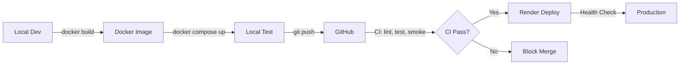

# Voygent Architecture

## Overview
Voygent MVP is built on a forked LibreChat foundation with minimal, controlled modifications to support AI-powered travel planning. The architecture emphasizes local→Docker→Render parity to ensure consistent behavior across all environments.

## Specification-Driven Development

This project uses **[GitHub Spec-Kit](https://github.com/github/spec-kit)** for structured, specification-driven development.

### Specs Directory Structure
```
specs/
├── _templates/       # Spec templates for this project
├── _archive/         # Completed/deprecated specs
├── _incoming/        # Import staging from local/GitHub sources
└── [active-specs]/   # Current specifications
```

All features begin with a specification that answers the **critical path question** before implementation. See [SPEC_KIT.md](docs/SPEC_KIT.md) for details.

---

## System Components

### Frontend
- **Base:** LibreChat React/TypeScript UI
- **Modifications:**
  - Travel Agent mode template menu
  - Progress/token-cost status bar
  - Trip search interface
  - Itinerary export controls
  - Subscription management dashboard

### Backend
- **Base:** LibreChat Node.js/Express API
- **Modifications:**
  - Travel Agent system prompt injection
  - Session/message logging middleware
  - Token counting and cost estimation
  - Credit ledger enforcement
  - Stripe webhook handlers
  - Validation engine integration

### Database
- **PostgreSQL 15+** with extensions:
  - `pgvector` for semantic search
  - Full-text search (tsvector) for keyword queries
- **Redis** for:
  - Session caching
  - Rate limiting
  - Job queues (validation, exports)

### External Services
- **Anthropic Claude** (primary LLM provider)
- **Secondary LLM Provider** (validation engine)
- **Stripe** (subscriptions and payments)
- **GitHub API** (itinerary publishing via MCP)
- **Render** (hosting platform)

---

## Data Model

### Core Tables

#### `llm_sessions`
Tracks each user conversation session.

```sql
create table llm_sessions (
  id uuid primary key default gen_random_uuid(),
  user_id uuid,
  started_at timestamptz default now(),
  mode text,  -- 'travel_agent', 'general', etc.
  model text, -- e.g. 'claude-3-5-sonnet-20241022'
  metadata jsonb
);
```

#### `llm_messages`
Stores individual messages with token/cost tracking.

```sql
create table llm_messages (
  id uuid primary key default gen_random_uuid(),
  session_id uuid references llm_sessions(id) on delete cascade,
  role text check (role in ('system','user','assistant','tool')),
  content text,
  tokens_in int default 0,
  tokens_out int default 0,
  cost_usd numeric(10,6) default 0,
  latency_ms int,
  provider text,
  created_at timestamptz default now(),
  tool_name text,
  tool_payload jsonb
);
```

#### `trip_index`
Hybrid search index for trip planning.

```sql
create table trip_index (
  id uuid primary key,
  user_id uuid,
  title text,
  summary tsvector,          -- Full-text search
  embedding vector(1536),    -- Semantic search (OpenAI/Anthropic embeddings)
  metadata jsonb,            -- Flexible schema for destinations, dates, preferences
  updated_at timestamptz
);
```

Full schema available in [docs/db/logging_schema.sql](docs/db/logging_schema.sql).

---

## Feature Flags

Voygent uses environment-based feature flags to control incomplete or experimental features:

```bash
FEATURE_TRAVEL_MODE=true       # Enable Travel Agent mode
FEATURE_PROGRESS=true          # Show progress/cost bar
FEATURE_COST_PANEL=true        # Display detailed cost dashboard
FEATURE_TELEMETRY=true         # Enable session logging
FEATURE_VALIDATION=true        # Enable secondary validation
```

All features default to `false` in production until fully tested.

---

## Environment Strategy

### `.env.shared.example`
Shared configuration across all environments (local, Docker, Render).

### `.env.local.example`
Local overrides for development (database URLs, API keys for testing).

### Environment Precedence
1. Render environment variables (production secrets)
2. `.env.local` (development overrides)
3. `.env.shared` (defaults)

**Never commit actual `.env` files.** All secrets managed via Render dashboard or local `.env.local`.

---

## Build & Deploy Flow



### Key Principles
1. **Same Dockerfile** for local and Render
2. **Smoke tests** must pass before deploy
3. **Healthcheck endpoint** (`/healthz`) confirms service health
4. **No direct edits on Render** - all changes via git

---

## Observability

### Logging
- **Structured JSON logs** (via `pino` or similar)
- **Levels:** debug, info, warn, error
- **Correlation IDs** for request tracing

### Metrics
- Token usage per session/user
- Response latency (p50, p95, p99)
- Cost per request
- Search query performance

### Monitoring
- **Render health checks** (HTTP 200 on `/healthz`)
- **Database connection pooling** stats
- **Redis cache hit rates**
- **Stripe webhook success/failure rates**

### Alerting
- Credit threshold warnings
- High error rates (> 5% over 5 min)
- Slow queries (> 1s)
- Failed deployments

---

## Security Considerations

### Authentication
- LibreChat's built-in OAuth/JWT flows
- Session tokens stored in Redis (short TTL)

### API Keys
- **Never commit secrets** to git
- Anthropic API keys in Render environment
- Stripe keys (test/prod) in Render environment
- Rotate keys quarterly

### Rate Limiting
- Per-user request limits (enforced via credit ledger)
- IP-based rate limiting (via Redis)
- Stripe webhook signature verification

### Data Privacy
- User conversations encrypted at rest (Postgres)
- PII redaction in logs
- GDPR-compliant data export/deletion

See [SECURITY.md](SECURITY.md) for detailed policies.

---

## Deployment Architecture

### Render Configuration
- **Service Type:** Web Service
- **Environment:** Docker
- **Build Command:** `docker build -t voygent-app .`
- **Start Command:** `node server.js` (or as defined in Dockerfile)
- **Health Check Path:** `/healthz`
- **Port:** 3008 (internal), 443 (external HTTPS)

### Scaling Strategy
- **Horizontal:** Multiple Render instances behind load balancer
- **Database:** Managed Postgres with connection pooling
- **Redis:** Managed Redis (Render add-on or external)

---

## Technology Stack

| Layer | Technology |
|-------|------------|
| Frontend | React 18, TypeScript, Tailwind CSS |
| Backend | Node.js 20, Express, TypeScript |
| Database | PostgreSQL 15+ (pgvector, tsvector) |
| Cache | Redis 7+ |
| LLM | Anthropic Claude 3.5 Sonnet |
| Payments | Stripe API v2024+ |
| Hosting | Render.com |
| CI/CD | GitHub Actions |
| Monitoring | Render metrics + custom logging |

---

## Development Workflow

1. **Branch** from `dev` for new features
2. **Develop** locally with `docker compose up`
3. **Test** with `bash scripts/smoke.sh`
4. **Commit** with conventional commit messages
5. **PR** to `dev` with critical path checkbox
6. **CI** runs lint, build, smoke tests
7. **Review** and merge to `dev`
8. **Promote** `dev` → `main` for production deploy

---

## Key Constraints

### Minimal LibreChat Modifications
- **Fork strategy:** Maintain upstream compatibility
- **Feature flags** for all custom behavior
- **UI changes** scoped to new components (avoid editing core LibreChat files)

### Local/Docker/Render Parity
- **Dockerfile** is the source of truth
- **No Render-specific hacks** - must work locally
- **Environment variables** manage environment differences

### Performance Budgets
- **Initial page load:** < 2s (p95)
- **Chat response:** < 3s (p95)
- **Search results:** < 500ms (p95)
- **Database queries:** < 100ms (p95)

---

## Future Considerations

- **Multi-region deployment** (Render edge)
- **CDN for static assets** (Cloudflare)
- **Advanced caching** (Redis + in-memory LRU)
- **Real-time collaboration** (WebSocket/CRDT)
- **Mobile app** (React Native)

---

## References

- [Spec-Kit Guide](docs/SPEC_KIT.md) - Specification-driven development
- [Spec Status](docs/specs_status.md) - Current specs overview
- [Database Schema](docs/db/logging_schema.sql)
- [System Prompts](docs/prompts/)
- [Contributing Guide](CONTRIBUTING.md)
- [Security Policy](SECURITY.md)
